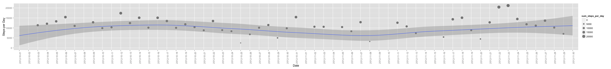

Coursera May 2015 session by Roger D. Peng, PhD, Jeff Leek, PhD, Brian Caffo

# i. Introduction

**i.1** *Environment Setup*


```r
# Setting locale for correct weekdays translation
Sys.setlocale("LC_TIME", "en_US")
```

```
## [1] "en_US"
```

```r
dt = Sys.time()
date <- format(dt,"%d-%b-%Y")
time <- format(dt,"%H:%M:%S")
```


```r
# Print version
version$version.string
```

```
## [1] "R version 3.1.2 (2014-10-31)"
```

**i.2** *Load required libraries.*


```r
# Analysis
library(dplyr)
# Plotting
library(lattice)
library(ggplot2)
```

**1.** *Load data and show brief summary.*


```r
# Data already downloaded and versioned in repo
data_dir = './'
activity_file_zip <- file.path(data_dir, "activity.zip")
activity_file <- file.path(data_dir, "activity.csv")
# unzip first time.
if(!file.exists(activity_file)) { 
  unzip (activity_file_zip, exdir=data_dir)
  print('data file uncompressed')
}
data = read.csv(activity_file, na.strings=c("NA"))
summary(data)
```

```
##      steps                date          interval     
##  Min.   :  0.00   2012-10-01:  288   Min.   :   0.0  
##  1st Qu.:  0.00   2012-10-02:  288   1st Qu.: 588.8  
##  Median :  0.00   2012-10-03:  288   Median :1177.5  
##  Mean   : 37.38   2012-10-04:  288   Mean   :1177.5  
##  3rd Qu.: 12.00   2012-10-05:  288   3rd Qu.:1766.2  
##  Max.   :806.00   2012-10-06:  288   Max.   :2355.0  
##  NA's   :2304     (Other)   :15840
```

```r
str(data)
```

```
## 'data.frame':	17568 obs. of  3 variables:
##  $ steps   : int  NA NA NA NA NA NA NA NA NA NA ...
##  $ date    : Factor w/ 61 levels "2012-10-01","2012-10-02",..: 1 1 1 1 1 1 1 1 1 1 ...
##  $ interval: int  0 5 10 15 20 25 30 35 40 45 ...
```

As per documentation the dataset is composed of the following fields:

1. steps: Number of steps taking in a 5-minute interval (missing values are coded as NA)
2. date: The date on which the measurement was taken in YYYY-MM-DD format
3. interval: Identifier for the 5-minute interval in which measurement was taken

Create per day summary and show brief summary.


```r
data_per_day <- group_by(data, date)
stats_steps_per_day <- summarise(data_per_day, sum_steps_per_day=sum(steps, na.rm=TRUE), mean_steps_per_day=mean(steps, na.rm=TRUE), median_steps_per_day=median(steps, na.rm=TRUE))
summary(stats_steps_per_day)
```

```
##          date    sum_steps_per_day mean_steps_per_day median_steps_per_day
##  2012-10-01: 1   Min.   :    0     Min.   : 0.1424    Min.   :0           
##  2012-10-02: 1   1st Qu.: 6778     1st Qu.:30.6979    1st Qu.:0           
##  2012-10-03: 1   Median :10395     Median :37.3785    Median :0           
##  2012-10-04: 1   Mean   : 9354     Mean   :37.3826    Mean   :0           
##  2012-10-05: 1   3rd Qu.:12811     3rd Qu.:46.1597    3rd Qu.:0           
##  2012-10-06: 1   Max.   :21194     Max.   :73.5903    Max.   :0           
##  (Other)   :55                     NA's   :8          NA's   :8
```

# 2. What is mean total number of steps taken per day?

**2.1** *Make a histogram of the total number of steps taken each day*


```r
with(stats_steps_per_day, {
    par(oma=c(2,0,0,0), mar=c(6.75,6.75,3,0), mgp=c(5.75,0.75,0), las=2)
    barplot(
      height=sum_steps_per_day,
      main="Total Steps per Day",
      xlab="Day",
      ylab="Steps per Day",
      names.arg=date,
      space=c(0)
    )
})
```

 

**2.2** *Calculate and report the mean and median total number of steps taken per day*


```r
# Mean per day
mean(stats_steps_per_day$sum_steps_per_day, na.rm = TRUE)
```

```
## [1] 9354.23
```

```r
# Median per day
median(stats_steps_per_day$sum_steps_per_day, na.rm = TRUE)
```

```
## [1] 10395
```


```r
ggplot(stats_steps_per_day, aes(date, sum_steps_per_day)) + geom_point(aes(size=sum_steps_per_day), alpha=1/2)  + geom_smooth(aes(group=1)) + scale_size_area() + xlab("Date") + ylab("Steps per Day") + theme(axis.text.x = element_text(angle = 90, hjust = 1))
```

 

# 3. What is the average daily activity pattern?

**3.1** *Make a time series plot (i.e. type = “l”) of the 5-minute interval (x-axis) and the average number of steps taken, averaged across all days (y-axis)*


```r
stats_mean_steps_per_day <- aggregate(steps ~ interval, data=data, FUN="mean", na.exclude=T)
xyplot(steps ~ interval, data=stats_mean_steps_per_day, type="l", grid=TRUE, ylab="Number of steps", xlab="5-min intervals from midnight", main="Mean number of steps by 5-min intervals")
```

 

3.2 Which 5-minute interval, on average across all the days in the dataset, contains the maximum number of steps?


```r
stats_mean_steps_per_day <- aggregate(steps ~ interval, data=data, FUN="mean", na.exclude=T)
stats_mean_steps_per_day$interval[which.max(stats_mean_steps_per_day$steps)]
```

```
## [1] 835
```

# 4. Imputing missing values

**4.1** *Calculate and report the total number of missing values in the dataset (i.e. the total number of rows with NAs)*


```r
# Missing steps
sum(is.na(data$steps))
```

```
## [1] 2304
```

```r
# Missing dates
sum(is.na(data$date))
```

```
## [1] 0
```

```r
# Missing intervals
sum(is.na(data$interval))
```

```
## [1] 0
```

**4.2** *Devise a strategy for filling in all of the missing values in the dataset.*

The strategy does not need to be sophisticated. For example, you could use the mean/median for that day, or the mean for that 5-minute interval, etc.


```r
str(stats_mean_steps_per_day)
```

```
## 'data.frame':	288 obs. of  2 variables:
##  $ interval: int  0 5 10 15 20 25 30 35 40 45 ...
##  $ steps   : num  1.717 0.3396 0.1321 0.1509 0.0755 ...
```

**4.3** *Create a new dataset that is equal to the original dataset but with the missing data filled in.*


```r
new_data_steps <- data.frame(data$steps)
new_data_steps[is.na(new_data_steps),] <- ceiling(tapply(X=data$steps,INDEX=data$interval,FUN=mean,na.rm=TRUE))
new_data <- cbind(new_data_steps, data[,2:3])
colnames(new_data) <- c("steps", "date", "interval")
```


```r
# verification
# Old
sum(is.na(data$steps))
```

```
## [1] 2304
```

```r
# New
sum(is.na(new_data$steps))
```

```
## [1] 0
```

```r
# Old
str(data$steps)
```

```
##  int [1:17568] NA NA NA NA NA NA NA NA NA NA ...
```

```r
# New
str(new_data$steps)
```

```
##  num [1:17568] 2 1 1 1 1 3 1 1 0 2 ...
```

**4.4.** *Make a histogram of the total number of steps taken each day and Calculate and report the mean and median total number of steps taken per day.*


```r
stats_steps_per_day_aggregate <- aggregate(steps ~ date, data=new_data, sum)

with(stats_steps_per_day_aggregate, {
    par(oma=c(2,0,0,0), mar=c(6.75,6.75,3,0), mgp=c(5.75,0.75,0), las=2)
    barplot(
      height=steps,
      main="Total Steps per Day (Missing estimated)",
      xlab="Day",
      ylab="Steps per Day",
      names.arg=date,
      space=c(0)
    )
})
```

 

**4.4.1** *Do these values differ from the estimates from the first part of the assignment?*


```r
# Mean
mean(stats_steps_per_day_aggregate$steps, na.rm=TRUE)
```

```
## [1] 10784.92
```

```r
# Median
median(stats_steps_per_day_aggregate$steps, na.rm=TRUE)
```

```
## [1] 10909
```

Estimating the missing values doesn't change the shape of the histogram
Median and mean values are also close.

**4.4.2** *What is the impact of imputing missing data on the estimates of the total daily number of steps?*

The total daily number of steps increases as a result of added values, specially around the mean.

A time series plot (i.e. type = “l”) of the 5-minute interval (x-axis) and the average number of steps taken, averaged across all days (y-axis)*


```r
mean_steps_per_interval <- aggregate(steps ~ interval, data=data, FUN=mean, na.exclude=TRUE)

xyplot(mean_steps_per_interval$steps ~ mean_steps_per_interval$interval,type="l", grid=T, ylab="Mean number of steps", xlab="5-min intervals from midnight", main="Mean number of steps by 5-min intervals, missing values estimated")
```

 

# 5. Are there differences in activity patterns between weekdays and weekends?

**5.1.** *Create a new factor variable in the dataset with two levels – “weekday” and “weekend” indicating whether a given date is a weekday or weekend day.*


```r
# Create new variable
new_data$day <- "weekday"
new_data$day[weekdays(as.Date(new_data$date), abb=T) %in% c("Sat","Sun")] <- "weekend"

#Verify
table(new_data$day)
```

```
## 
## weekday weekend 
##   12960    4608
```

**5.2.** *Make a panel plot containing a time series plot (i.e. type = “l”) of the 5-minute interval (x-axis) and the average number of steps taken, averaged across all weekday days or weekend days (y-axis).*


```r
mean_steps_per_interval_no_miss <- aggregate(steps ~ interval + day, data=new_data, FUN=mean)

xyplot(steps ~ interval | day, data=mean_steps_per_interval_no_miss, type="l", grid=T, layout=c(1,2), ylab="Mean number of steps", xlab="5-minutes intervals from 00:00AM", main="Mean 5-min. activity intervals: Weekdays vs Weekends")
```

 

Same comparison with overlapped plots.


```r
xyplot(steps ~ interval, data=mean_steps_per_interval_no_miss, groups=mean_steps_per_interval_no_miss$day, type="l", grid=T, ylab="Mean number of steps", xlab="5-min. intervals from midnight", main="Weekdays (blue) vs Weekends (purple)")
```

 

# References

1. R Markdown v2 [http://rmarkdown.rstudio.com/]
2. R Core Team. R: A language and environment for statistical computing. [http://www.R-project.org].
3. Lattice: high-level data visualization system [http://lattice.r-forge.r-project.org/].
